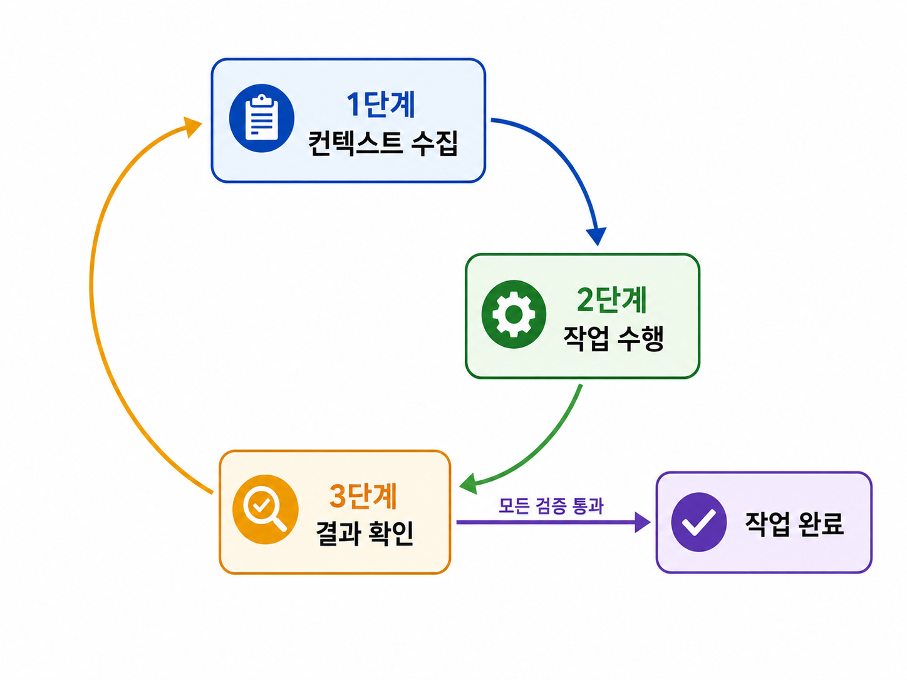

# 1-1 클로드 코드와 에이전틱 코딩
## 학습 목표 
- 클로드 코드의 기본 개념
- 클로드 코드의 핵심 동작 원리(에이전틱 루프)
- 컨텍스트 윈도우 관리 전략
- CLI 기본 명령어
- 체크포인트, 되감기 시스템의 활용법
***
## AI들의 특징
- **OpenAI(chatGPT)**: 텍스트, 영상, 이미지 생성 등을 아우르는 범용 AI
- **구글(Gemini)**: 검색과 클라우드 서비스 통합 주력
- **앤트로픽(Claude)**: 에이전틱 AI 제품화에 주력

## 클로드의 강점
1. 코드 생성의 정확도
2. 긴 문맥 처리 능력

이러한 강점을 개발자의 로컬 환경으로 이식 -> **클로드 코드**
- **클로드 코드**: 소프트웨어 개발에 특화된 에이전틱 코딩 도구
- **클로드 코드 CLI**: 클로드 코드를 터미널에서 실행하는 **인터페이스**
***

## 에이전틱 코딩
- 기존 AI 코딩 도구: 코드를 예측하는 보조 도구
- **에이전틱 코딩**: AI가 파일 시스템 탐색, 코드 수정, 테스트 실행까지 **자율**로 수행하는 접근 방식.

사람은 목표와 제약 조건만 정의하고 에이전트는 허용된 모든 도구를 직접 호출하며 작업을 완료한다. 

결국 기존에 일반 개발자가 하던 작업은 에이전트가 담당하게 되고, 상급자·시니어·리더의 역할이던 목표 정의와 최종 검수가 일반 개발자들도 역량을 펼칠 수 있게 되었다.

> **메모**: 상급자들은 기존에 줄곧 하던 작업이니 어려울 것이 없고, 오히려 피해받는 이는 실무를 통해 이 과정을 배워나가야 하는 주니어와 미들 아닐까?

#### 에이전틱 코딩의 작업 과정
각 단계는 내장 도구로 자동 실행하며, 개발자가 필요한 단계에서 개입해 방향 조정.
1. 개발자가 목표를 제시
2. 하위 작업으로 분해
3. 실행 계획 수립
4. 완수

→ **탐색 - 계획 - 구현 - 커밋** 워크플로로 정의할 수 있다.

### 에이전틱 코딩 도구
| 구분 | 예시 | 특징 |
|---|---|---|
| IDE형 도구 | 커서(Cursor) | 에디터에 에이전트 모드를 통합, 익숙한 GUI 환경에서 사용 |
| CLI 기반 도구 | 클로드 코드 | 에디터 없이 터미널에서 작동, 특정 에디터에 종속되지 않음 |

CLI 기반 도구는 MCP 서버를 연결하면 외부 서비스까지 접근 범위가 확장된다.

> **CLI 기반 에이전틱 도구가 외부 서비스에 접근할 수 있는 이유**
>
> 로컬 터미널에서 실행되기 때문에 로컬 환경의 파일, 명령어, 인증 정보, 네트워크를 활용할 수 있고, 그 결과 외부 서비스까지 작업 범위를 넓힐 수 있다.
>
> 단, 실제 가능한 작업 범위는 터미널 / OS / 외부 서비스 / 도구 설정의 권한에 의해 결정된다.

CLI 기반 에이전틱 코딩 도구는 터미널에서 작동하기 때문에 대량의 로그를 분석하는 작업에서도 높은 효율을 보인다.
 
***

### 에이전틱 루프
클로드 코드가 작동하는 순환 방식을 **에이전틱 루프**라고 한다.

질의응답식의 일회성 대화와 달리, **컨텍스트 수집 → 작업 수행 → 결과 확인**의 과정을 거치고, 문제가 발견되면 다시 처음으로 돌아가 작업을 반복한다.

#### 1단계. 컨텍스트 수집
프롬프트를 받아 즉시 작업을 수행하는 것, 즉 코드를 작성하는 것이 아니라 프로젝트의 구조를 파악하며 프롬프트와 관련 있는 정보를 수집한다.

#### 2단계. 작업 수행
1단계에서 얻은 컨텍스트를 기반으로 실행 계획을 세우고 필요한 도구를 호출한다.

#### 3단계. 결과 확인
클로드 코드 자신이 수행한 작업을 스스로 검증한다.

1. 규칙 기반 피드백: 명확한 규칙으로 검증(like 린팅)
2. 시각적 피드백: 스크린샷, 렌더링 결과로 시각적 출력을 평가
3. LLM기반 피드백: 다른 언어 모델에 의해 평가 받는 것.

검증으로 문제가 발생하면 다시 1단계로 돌아가 수정을 반복한다.

> 각 단계는 고정된 순차적 실행이 아니라 상황에 따라 유동적으로 진행한다.

*** 

## 컨텍스트 윈도우
컨텍스트 윈도우는 대화의 진행에 따라 사용자의 프롬프트, 클로드의 응답, 도구 호출과 결과가 순서대로 저장된다.

클로드가 지원하는 컨텍스트 윈도우는 20만 토큰으로 토큰 수가 증가하면 정보 회상의 정확도가 떨어지고 장거리 추론 능력이 약화된다.

> 따라서 **필요한 부분만 지정해서 작업할 수 있도록 프롬프트를 작성하는 것이 중요**하다.

컨텍스트 윈도우의 크기는 작업의 복잡성과 밀접하다. 컨텍스트를 무분별하게 채울 경우 응답 품질이 저하될 수 있으므로 어떤 정보를 컨텍스트에 포함할지 항상 의식적으로 관리해야 한다.

### 컨텍스트 윈도우 관리 전략
1. **컴팩션**: 컨텍스트 윈도우 사용량이 98%에 도달하면 이전 대화 내용을 자동으로 요약 → 긴 작업에서도 에이전트가 중단되지 않음
2. **`/clear` 명령**: 대화 기록을 완전히 초기화. 서로 관련 없는 작업을 연속으로 수행할 때 유용
3. **점진적 공개**: 처음부터 모든 정보를 로드하지 않고, 필요할 때 도구로 데이터를 동적으로 로드
4. **서브에이전트 활용**: 서브에이전트는 메인 에이전트와 별도의 독립된 컨텍스트 윈도우를 사용 → 여러 서브에이전트가 각각 독립적으로 작업한 뒤, 메인 에이전트가 요약·종합
5. **구조화된 메모 작성**: 컨텍스트 외부에 md 파일로 체크리스트를 작성해두고 필요할 때 로드

### 클로드 코드의 4대 핵심 기능
1. 자연어 기반의 기능 구축
2. 심층 디버깅 및 문제 해결
3. 코드베이스 탐색과 분석
4. 반복 태스크 자동화

> **메모**: 결국 프로젝트 구조든 외부 서비스든, 전체적으로 어느 정도 체계가 잡혀 있어야 에이전트 사용도 유용해질 것 같다.

### 클로드 코드 모드
#### 대화형 모드
- REPL(Read-Eval-Print Loop)스타일의 자연어 대화형 세션
- 탐색 작업, 장기  세션에 적합.
- 세션 시작 시, 프로젝트 구조 자동 인식.
- CLAUDE.md 컨텍스트 활용
- .claude/ 디렉터리: 커스텀 명령어 및 에이전트 설정 저장(팀원 공유 가능)

#### 비대화형 모드(헤드리스 모드)
- 클로드 코드 실행을 위해 `-p`,`--print` 플래그 사용.
- 프롬프트의 결과만 출력하고 종료
- 스크립팅과 자동화 시 유리

#### 실행 플래그
모든 플래그는 앞단에 `claude`를 작성 후 사용.

| 플래그 | 설명 |
|---|---|
| (플래그 없이 바로 질문) | 일회성 작업 시 즉시 실행 |
| `-p`, `--print` | 비대화형 실행, 결과만 출력 후 세션 종료 |
| `-c`, `--continue` | 세션 재개, 이전에 진행하던 작업을 이어서 진행 |
| `-r`, `--resume` | 특정 세션을 선택해 다시 이어서 작업 |

***

### 체크포인트와 되감기 시스템
클로드 코드는 체크포인트 기능을 사용하여 편집 및 대화를 추적하며 되돌리기와 요약을 통해 세션을 관리한다.
이는 높은 자율도로 인해 발생할 수 있는 원치 않는 변경에 대비한 자동 안정망 시스템이다.

- 사용자가 새로운 프롬프트를 작성할 때마다 체크포인트가 자동으로 생성되어, 프롬프트 단위로 작업을 되돌릴 수 있다.
- 잘못된 변경이나 마음에 들지 않는 작업을 되돌릴 때뿐 아니라, 현재 작동하는 상태를 유지한 채 새로운 방식을 시도해보고 싶을 때에도 유용하다.
- 옵션에 따라 대화만, 코드만, 또는 대화와 코드 모두 복구할 수 있다.

> **주의**
> - 체크포인트는 세션에 포함된 기능이므로, 세션의 저장 기간이 지나면 체크포인트도 함께 정리된다.
> - 클로드 코드의 기능이므로, 클로드 코드 세션 내에서 발생한 변경만 저장한다.
