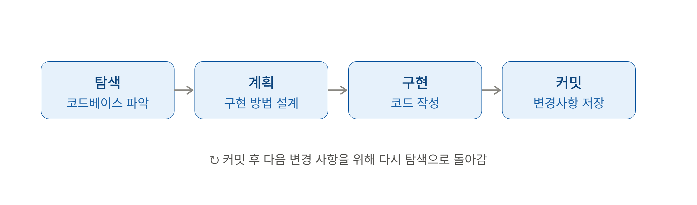
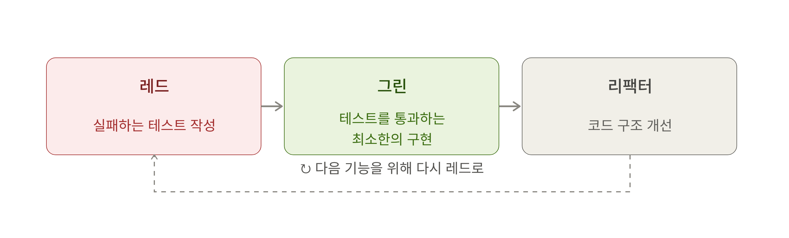
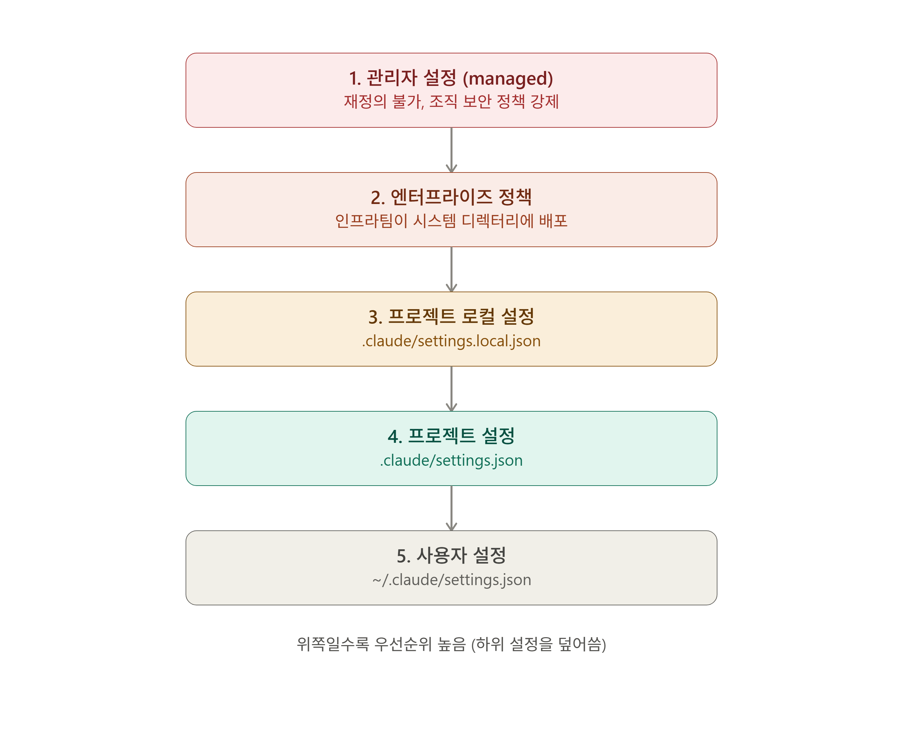

# 2. 워크플로와 설정
## 학습 목표 
- 클로드 코드를 활용한 작업 패턴, 설정
- setting.json 설정
- 권한 관리(IAM) 시스템
***

## 2-1. 기본 작업 방식
### 탐색-계획-구현-커밋 워크를로

사용자가 높은 수준의 목표를 제시하면 클로드 코드는 작업 과정을 체계화하여 수행한다.
#### 1. 탐색
코드베이스의 구조와 맥락을 파악하는 단계로 전체를 분석하고 구성 요소 간의 상호작용을 파악한다.
루트부터 세부 구조로 내려가는 타입이기 때문에 특정 영역으로 좁혀가는 점차적 접근법이 효과적이다.

#### 2. 계획
구현 전략을 수립하는 단계로 클로드 코드에서는 플랜 모드를 사용하여 쉽게 사용할 수 있는 단계다. 해당 단계에서는 구현에 필요한 파일 목록, 수정 순서, 예상 영향 범위를 정리해준다.

복잡한 아키텍처 결정이나 다단계 구현이 필요할 경우 확장 사고를 활용하나 토큰 사용량이 크므로 주의 깊게 사용하거나 최대 토큰 사용량을 설정에서 조절해야 한다.

> 플랜 모드 사용 판단법: 변경 대상 파일이 3개 이상이거나 구현 방향이 불확실한 경우

#### 3. 구현
계획에 따라 실제 코드를 작성하는 단계로, 필요에 따라 테스트 실행, 빌드 검증까지 처리한다.

해당 단계에서는 작은 단위로 나누어 검증하면서 진행하는 점진적 접근이 중요하며 이러한 방식은 오류를 최소화할 수 있다.

#### 4. 커밋
구현된 변경 사항을 깃 저장소에 저장한다. 해당 단계를 잘 활용하여 작업 단위가 완료될 때마다 커밋하고 변경 이력을 쉽게 추적할 수 있게 된다.

> 각 단계는 순환적 구조를 기반으로 한 개별적 단계이므로, 무조건 순차적으로 진행되지 않음을 기억하라.

## 탐색과 분석
탐색과 분석은 다음 단계로 이루어진다.

위 패턴을 활용하면 필요한 파일의 경로가 컨텍스트에 적재되어 불필요한 토큰 소비를 줄일 수 있으며, 광범위한 탐색을 줄여 컨텍스트 낭비를 줄일 수 있다.

하지만 이미 프로젝트 구조에 대해 파악하고 있다면 `@`를 통해 쉽게 탐색 범위를 줄여 명령을 수행시킬 수 있다.

> **예시**
> 
> @src/utils/auth.js 파일의 로직을 설명해 줘

### 플랜 모드
탐색과 분석 단계에서 의도치 않게 코드가 수정될 수 있다. 이러한 상황을 예방하기 위해 존재하는 것이 **플랜 모드** 이다.

**플랜 모드**는 코드를 수정하지 않고 안전하게 개발 계획을 세울 수 있는 읽기 전용 모드로 해당 모드를 사용하기 적합한 상황은 아래와 같다.
1. **다단계 기능 구현**: 여러 파일에 걸친 기능 구현 시 **전체 구조 설계**
2. **코드 조사 단계** 
3. **대화형 협의**: 반복 피드백을 방향 조정 시

**플랜 모드 활성화 방법**

| 플래그                                  | 설명                 |
|--------------------------------------|--------------------|
| **shift+Tab**                        | 세션 중 변환            |
| **claude --permission-mode plan**    | 새 세션을 플랜 모드로 시작    |
| **claude --permission-mode plan -p** | 비대화형 모드에서 플랜 모드 사용 |

## 점진적 개발 전략
점진적 개발이란 복잡한 기능을 작은 단위로 분해해 순차적으로 구현하는 접근 방식이다. 
각 단계의 결과를 검증한 뒤 다음 단계로 진행할 수 있기 때문에 에이전틱 코딩에서 아주 유용한 전략법이다.

### 작업 범위의 명확한 정의
독립적으로 테스트 가능한 단위로 분해하며, 각 단계가 완료될 때마다 검증하고 다음 단계로 진행한다.
작업은 이 단위만으로 테스트가 실행해 성공, 실패를 판정할 수 있는가의 기준으로 분해한다.

> **질문**
> 
> 개념은 알겠는데 테스트를 쪼갤 수 있는지 없는지는 어떻게 판단하지?

### 피드백 루프 활용
구조화된 피드백(테스트 결과, 린터, 빌드 로그 등)을 받을 때 오류를 정확히 교정한다.
이 피드백 루프가 존재하지 않을 경우 사용자가 유일한 검증 수단이 되며, 하나하나 클로드 코드에게 명령하는 것을 비효율적이다.
따라서 반복적인 지시를 수행하는 비용이 높으므로 자동화된 검증 수단을 확보하여 사용하는 것이 효율적이다.

> **질문**
> 
> 어떻게 자동화된 검증 수단을 확보하죠? 그 방법을 배우려고 하는건데 말이 없으시네..

### 컨텍스트 관리
컨텍스트 윈도우가 소진되면 클로드 코드의 응답 품질이 저하되기 대문에 여러가지 방법으로 컨텍스트를 정리하거나 압축한다.
- `/compact`: 대화 내용 요약
- `/clear`: 대화 내용 정리 및 새 시작
- `/mcp`: 사용하지 않는 서버 비활성화
- 자동 압축: 임계치에 도달할 경우 자동 요약 기능

### TDD 패턴
**TDD**, 즉 **테스트 주도 개발**은 점진적 개발 전략을 가장 효율적으로 사용할 수 있는 방법론으로 **레드-그린-리팩터 사이클**을 사용한다.

#### 레드 단계
구현할 기능의 예상 동작을 정의하는 테스트를 먼저 작성한다. 구현된 기능이 없기 때문에 테스트는 반드시 실패한다.

#### 그린 단계
레드 단계에 작성한 테스트 코드를 통과하기 위한 최소한의 코드를 작성하도록 한다. 

이 단계에서 클로드 코드는 기능을 구현하고 테스트를 실행하여 결과가 성공할 때까지 코드를 수정한다.

#### 리팩터 단계
그린 단계에서 작성된 테스트에 통과한 코드를 기능을 유지하면서 구조를 개선하거나 중복을 제거하는 단계이다.

> TDD는 테스트 범위의 누락 부분을 파악하여 엣지 케이스로 보완하는 것이 중요하다.

### 깃 작업 트리
작업 트리는 하나의 로컬 저장소를 공유하면서 여러 개의 브랜치를 서로 달느 폴더(작업 디렉토리)에서 동시에 체크아웃하고 작업할 수 있게 해주는 기능이다.

**작업 트리 생성 명령어**: `git worktree add <폴더 경로> -b <새로운 브랜치명> <기준 브랜치>`

각 작업 트리에서 별도의 클로드 코드 세션을 실행하면 독립된 작업 공간에서 **병렬**로 개발할 수 있다.

### `git branch` vs `git worktree`

* `git branch`: 하나의 저장소 안에서 작업 흐름을 나누는 **커밋 포인터**
* `git worktree`: 여러 브랜치를 각각 다른 폴더에 체크아웃해 **동시에 작업할 수 있게 하는 기능**

즉, `branch`는 **작업의 버전**, `worktree`는 **그 브랜치를 펼쳐놓은 작업 폴더**다.

> **질문**
> 
> 그럼 worktree는 branch의 큰 개념일까?

### 비대화형 모드와 파이프
#### 비대화형 모드
비대화형 모드에도 세션을 재개할 수 있다는게 이게 왜 중요한 지 잘 모르겠음. 
스트립트나 자동화 환경에서도 이전 컨텍스트를 유지하면서 작업을 진행할 수 있고 CI/CD 파이프라인이나 배치 처리에 유용하다는데 그러니까 왜?

#### 파이프
파이프(|)와 표준 입출력을 활용하여 다른 도구와 유연하게 연동할 수 있다는데 그럼 이를 통해 유닉스 명령어를 클로드를 통해 자연어로 명령해서 자동화할 수 있다는걸까? 
복잡한 명령어를 사용할 필요 없이?

## 2-2. 설정 관리
`settings.json`파일을 통해 클로드 코드의 동작을 제어하는 설정을 할 수 있다.
해당 파일은 팀 규칙 뿐만 아니라 개인 설정과 다양한 수준의 설정을 관리할 수 있도록 계층적 구조를 제공한다.

### settings.json의 특징
- 형식: JSON
- 제어 설정: 권한 규칙, 환경 변수, 도구 설정 등
- 적용 범위: 파일이 배치된 위치에 따라 달라짐
- 확인 및 수정 명령어: `/config`

> 적용 범위를 다양하게 할 수 있어 여러 위치의 설정 파일을 계층적으로 병합해 최종 설정을 결정

### 클로드 코드 설정 5단계

1. 관리자 설정: 사용자 재정의 X, 조직 전체의 보안 정책을 강제하는 데 사용.
2. 엔터프라이즈 정책: 사용자 재정의 X, 인프라팀이 시스템 디렉터리에 배포.
3. 프로젝트 설정: `.claude/settings.json`에 정의. 코드 컨벤션, 테스트 절차, 프로젝트별 도구 권한 등 저장.
4. 프로젝트 로컬 설정: `/claude/settings.local.json`에 정의. 팀 표준을 따르되 개인별로 조정이 필요할 때 사용.
5. 사용자 설정: `~/.claude.settings.json`에 정의. 사용자의 모든 프로젝트에 적용. 개인 선호 모델, 전역 권한 규칙, 원격 분석 비활성화 같은 설정을 저장.

### 기본 설정 옵션
| 키        | 설명 |
|----------|---|
| `apiKeyHelper` |인증값을 생성하는 커스텀(사용자 정의) 스트립트의 경로를 지정하는 설정.|
| `cleanupPeriodDays` |로컬 채팅 기록의 유지 기간을 설정.|
| `env`      |모든 세션에 적용된 환경 변수를 정의하는 설정.|
| `includeCoAuthoredBy` |팀 협업 환경에서 AI 지원 코드의 출처를 표기.|
| `outputStyle` |출력 형식과 스타일을 변경하는 설정.|
| `hooks`    |도구 실행 전후에 실행되는 커스텀 명령을 정의하는 설정.|
| `permissions`                | 권한 구조                                                              |
| `disableAllHooks`            | 모든 훅 비활성화. `true` 또는 `false`                                                            |
| `statusLine`                 | 컨텍스트를 표시할 커스텀 상태 표시줄 |
| `outputStyle`                | 출력 스타일 구성                                                        |
| `forceLoginMethod`           | 로그인 방식 제한. `claudeai` 또는 `console`                                                      |
| `enableAllProjectMcpServers` | 프로젝트 `.mcp.json`의 모든 MCP 서버 자동 승인. `true` 또는 `false`                                    |
| `enabledMcpjsonServers`      | 승인할 특정 MCP 서버 목록                                          |
| `disabledMcpjsonServers`     | 거부할 특정 MCP 서버 목록                                               |

### 권한 설정 옵션
| 키                              | 설명                                                                       |
| ------------------------------ | ------------------------------------------------------------------------ |
| `allow`                        | 도구 사용을 허용할 권한 규칙 배열. Bash 규칙은 접두사 일치 사용    |
| `ask`                          | 도구 사용 시 확인을 요청할 권한 규칙 배열                 |
| `deny`                         | 도구 사용을 거부할 권한 규칙 배열. 민감한 파일 제외에 활용` |
| `additionalDirectories`        | 클로드 코드가 접근할 수 있는 추가 작업 디렉터리                      |
| `defaultMode`                  | 클로드 코드 시작 시 기본 권한 모드                            |
| `disableBypassPermissionsMode` | `"disable"`로 설정하여 `bypassPermissions` 모드 비활성화        |

### 프로젝트별 설정 전략

## 단어 학습
| 용어           | 설명                        |
|--------------|---------------------------|
| **테스트 스캐폴딩** | 테스트 코드의 초기 구조를 자동 생성하는 기법 |